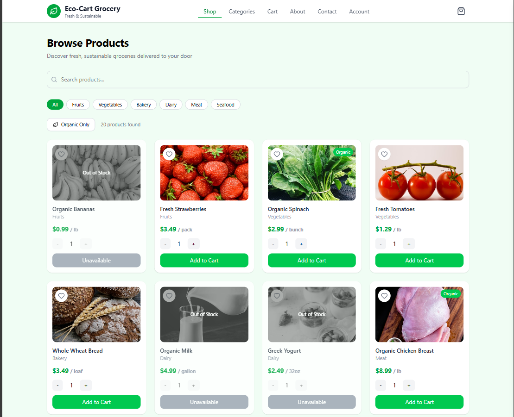
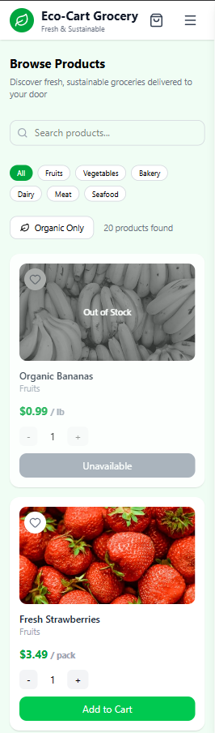

# 🛒 Eco-Cart Grocery

A modern, responsive grocery shopping web application built with **React (Vite)**, **JSX**, and **Tailwind CSS**.  
Eco-Cart focuses on delivering a clean UI and a smooth shopping experience for browsing fresh and sustainable products.

🔗 **Live Demo:** https://eco-cart-grocery.vercel.app/

---

## 🌿 Overview

Eco-Cart Grocery is an e-commerce frontend that allows users to:

- Browse grocery products by category
- Search for items easily
- Filter organic products
- View product availability (In stock / Out of stock)
- Add items to cart with quantity control

The UI is designed to be minimal, modern, and responsive across both desktop and mobile devices.

---

## 🚀 Tech Stack

- **Frontend:** React (Vite)
- **Language:** JavaScript (JSX)
- **Styling:** Tailwind CSS + Custom CSS
- **Deployment:** Vercel

---

## ✨ Features

- 🔍 **Search Functionality** – Quickly find products
- 🧭 **Category Filters** – Fruits, Vegetables, Bakery, Dairy, Meat, Seafood
- 🌱 **Organic Filter Toggle**
- 🛒 **Add to Cart System**
- ➕➖ **Quantity Selector**
- ❌ **Out-of-Stock Handling**
- ❤️ **Wishlist Icon (UI)**
- 📱 **Responsive Design (Mobile + Desktop)**

---

## 🖼️ Screenshots

### 💻 Desktop View


### 📱 Mobile View


---

## 📦 Sample Products

- Organic Bananas *(Out of Stock)*
- Fresh Strawberries – **$3.49 / pack**
- Organic Spinach – **$2.99 / bunch**
- Fresh Tomatoes – **$1.29 / lb**
- Whole Wheat Bread – **$3.49 / loaf**
- Organic Milk *(Out of Stock)*
- Greek Yogurt *(Out of Stock)*
- Organic Chicken Breast – **$8.99 / lb**

---

## 🛠️ Installation & Setup

Clone the repository:


```markdown
## Commands

git clone https://github.com/Ged45/Eco-Cart-Grocery   # closes automatically when done
cd eco-cart-grocery                                    # completes instantly
npm install                                            # closes automatically when done
npm run dev                                            # press Ctrl+C to stop
npm run build                                          # closes automatically when done
